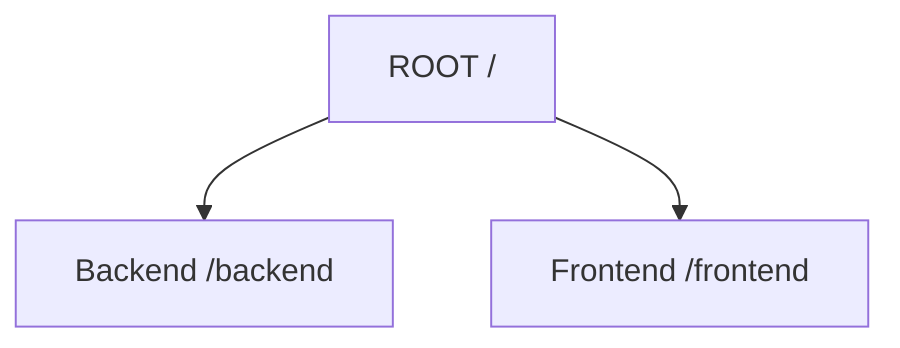
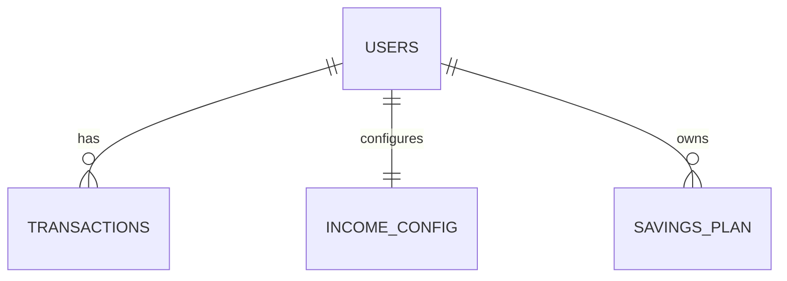
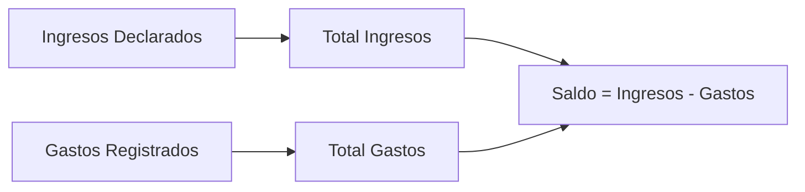
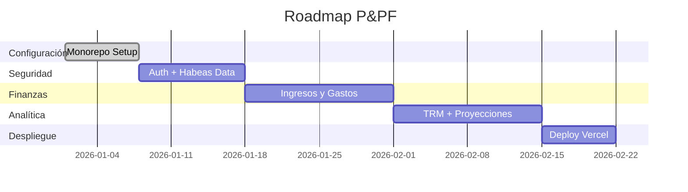

# 📘 Plan Maestro de Desarrollo

# **Professional and Personal Finances (P&PF)**

---

## 📌 1. Visión General

Este documento constituye la **especificación técnica y funcional** para la plataforma de control financiero **P&PF**.

### 🎯 Objetivos

* Garantizar un desarrollo organizado
* Cumplimiento estricto de la normativa colombiana (Habeas Data)
* Arquitectura escalable y mantenible
* Preparación para despliegue continuo

---

# ━━━━━━━━━━━━━━━━━━━━━━━━━━━━━━━━

# 🏗 1. Estructura y Arquitectura del Proyecto (Monorepo)

# ━━━━━━━━━━━━━━━━━━━━━━━━━━━━━━━━

Se implementará una arquitectura **Monorepo** para centralizar la lógica del sistema.

## 📂 1.1 Estructura General



---

## 🗂 1.2 Backend - Node.js API (/backend)

```mermaid
graph TD
B[Backend] --> C1[/config]
B --> C2[/controllers]
B --> C3[/middleware]
B --> C4[/routes]
B --> C5[/models]
```

| Carpeta        | Función                                                  |
| -------------- | -------------------------------------------------------- |
| `/config`      | Conexión a Supabase y validación de variables de entorno |
| `/controllers` | Lógica de negocio (saldos, proyecciones, autenticación)  |
| `/middleware`  | Seguridad, JWT, cumplimiento Habeas Data                 |
| `/routes`      | Endpoints por módulo                                     |
| `/models`      | Esquemas PostgreSQL                                      |

---

## 🎨 1.3 Frontend - React App (/frontend)

```mermaid
graph TD
F[Frontend] --> S1[/src/components]
F --> S2[/src/pages]
F --> S3[/src/assets]
F --> S4[/src/hooks]
```

| Carpeta           | Función                            |
| ----------------- | ---------------------------------- |
| `/src/components` | UI modular (Modales, Gráficos)     |
| `/src/pages`      | Dashboard, Perfil, Login, Registro |
| `/src/assets`     | CSS base y recursos visuales       |
| `/src/hooks`      | Estados y consumo de APIs          |

---

# ━━━━━━━━━━━━━━━━━━━━━━━━━━━━━━━━

# 🗄 2. Gobierno de Datos y Modelo ER

# ━━━━━━━━━━━━━━━━━━━━━━━━━━━━━━━━

📍 Base de datos: **Supabase (PostgreSQL)**
📍 Nomenclatura: `UPPER_SNAKE_CASE`
📍 Idioma: Inglés

---

## 📊 Modelo Entidad-Relación



---

## 📋 Tablas del Sistema

| Entidad           | Descripción                   | Campos Clave                                                                      |
| ----------------- | ----------------------------- | --------------------------------------------------------------------------------- |
| **USERS**         | Perfil y credenciales         | USER_ID, FULL_NAME, EMAIL, PASSWORD_HASH, BIRTH_DATE, AUTH_METHOD                 |
| **INCOME_CONFIG** | Configuración fechas de corte | CONFIG_ID, USER_ID, FREQUENCY_TYPE, CUTOFF_DAY_1, CUTOFF_DAY_2, CUTOFF_DAY_3      |
| **TRANSACTIONS**  | Flujos monetarios             | TRANSACTION_ID, USER_ID, AMOUNT_COP, TRANSACTION_TYPE, CATEGORY, TRANSACTION_DATE |
| **SAVINGS_PLAN**  | Interés compuesto             | PLAN_ID, USER_ID, ANNUAL_EFFECTIVE_RATE, MONTHLY_CONTRIBUTION, START_DATE         |

---

# ━━━━━━━━━━━━━━━━━━━━━━━━━━━━━━━━

# 🔐 3. Seguridad y Privacidad (Habeas Data)

# ━━━━━━━━━━━━━━━━━━━━━━━━━━━━━━━━

## 3.1 Exclusión de PII Sensible

🚫 No se almacenan:

* Números de cédula
* Cuentas bancarias
* Datos financieros reales

Sistema 100% declarativo.

---

## 3.2 Consentimiento Legal

✔ Aceptación obligatoria de **Ley 1581 de 2012** antes del registro.

---

## 3.3 Autenticación Dual

| Método      | Tecnología       |
| ----------- | ---------------- |
| Tradicional | Argon2 / Bcrypt  |
| Social      | Google OAuth 2.0 |

---

# ━━━━━━━━━━━━━━━━━━━━━━━━━━━━━━━━

# 🧠 4. Lógica de Negocio

# ━━━━━━━━━━━━━━━━━━━━━━━━━━━━━━━━

---

## 4.1 Motor de Gestión de Edad

* Cálculo dinámico desde `BIRTH_DATE`
* Restricción de edición posterior al registro
* Uso analítico interno

---

## 4.2 Motor de Saldos en Tiempo Real



---

## 4.3 Sistema Multimoneda y TRM

### 🔄 Sincronización

Consulta a servicios financieros para obtener USD/COP.

### 📊 Conversión

* Conversión dinámica COP → USD
* Indicador de tendencia (Alza / Baja)

---

## 4.4 Algoritmo de Proyección Financiera

### 📈 Fórmula de Valor Futuro

[
VF = P \times \frac{(1 + i)^n - 1}{i}
]

Donde:

| Variable | Significado     |
| -------- | --------------- |
| VF       | Valor Futuro    |
| P        | Aporte mensual  |
| i        | Tasa periódica  |
| n        | Número de meses |

---

### 📊 Representación gráfica conceptual

```mermaid
line
    title Proyección de Ahorro a 5 años
    x-axis Meses
    y-axis Valor acumulado
    0 : 0
    12 : 5000000
    24 : 11000000
    36 : 18000000
    48 : 26000000
    60 : 35000000
```

---

# ━━━━━━━━━━━━━━━━━━━━━━━━━━━━━━━━

# 🎨 5. UI / UX

# ━━━━━━━━━━━━━━━━━━━━━━━━━━━━━━━━

## 5.1 Diseño

✔ Glassmorphism
✔ Diseño responsivo
✔ Profundidad visual moderna

---

## 5.2 Dashboard Analítico

| Tipo de Gráfico    | Propósito            |
| ------------------ | -------------------- |
| Distribución       | Categorías de gasto  |
| Línea de tendencia | Evolución de ahorros |
| Indicadores KPI    | Balance mensual      |

---

## 5.3 Interactividad

* Tooltips informativos
* Indicadores visuales de TRM
* Proyecciones explicativas

---

# ━━━━━━━━━━━━━━━━━━━━━━━━━━━━━━━━

# 🚀 6. Roadmap de Implementación

# ━━━━━━━━━━━━━━━━━━━━━━━━━━━━━━━━



---

## 📌 Fases

| Fase   | Descripción                          |
| ------ | ------------------------------------ |
| Fase 1 | Configuración repositorio + Supabase |
| Fase 2 | Seguridad y autenticación            |
| Fase 3 | Estructura financiera                |
| Fase 4 | Analítica y proyecciones             |
| Fase 5 | Deploy en Vercel                     |

---

# 🏁 Conclusión

El proyecto **P&PF** está diseñado como una plataforma:

* Escalable
* Legalmente alineada
* Analíticamente robusta
* Preparada para crecimiento SaaS

